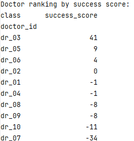
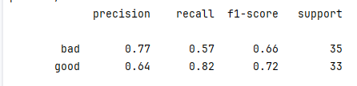

Some general remarks on the process

# Processing the sumarries ("get_structured_summaries")
* this is the most heavy use of LLM-calls so added parrallelization
* can and should be done in other LLM calls in the project

# Clustering

* this is NOT scalable as is
* when clustering 1 billion rows, a different approach is needed
 one good option: cluster ~1 million rows, and then create a classifier
 this classifier can be used to assign the rest of the rows to the clusters
* Clustering has clusters that should be merged in future work (either better algo
 or another phase which merges clusters with the same label)
* lables were chosen robustly by the most common (LLMs can help do a much better job)  

# Ranking
* did something very robust, and only printed it out, so here's the output:

# Prediction

* I used an LLM to first classify the "future_output" into "good"  / "bad" / "neutral"
* did not take the "neutral" into account in this classifier (so it is not a 3-class classifier)
* with more examples, I think it should be added

* I chose an approach that takes a pretrained model to get "smart" embeddings
* but that further fine-tunes the model on the data (via transformer layers)
* there is certainly much that can be improved here, but I think this is a good start

* did this very quickly, so the results are not very good

# Dockerization
* added the requirements.txt file and a basic Dockerfile
* did NOT check if it actually works! (out of time for this)